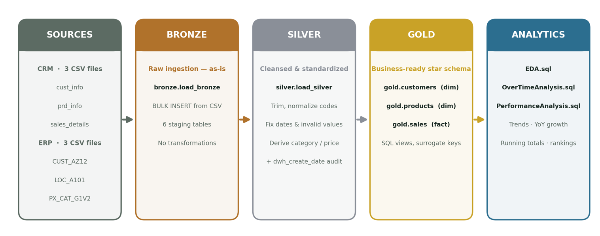
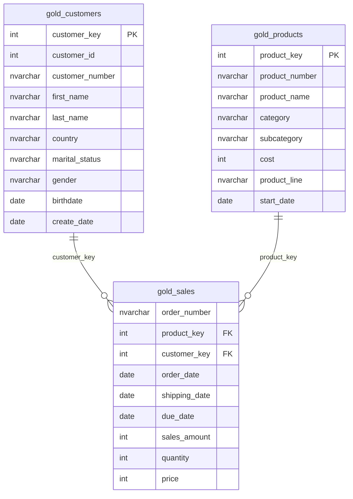

# SQL Data Warehouse & Sales Analytics

End-to-end **SQL Data Warehouse** built on the **Medallion Architecture**
(Bronze → Silver → Gold), covering ETL, data cleansing, dimensional modeling,
exploratory data analysis, and advanced sales-performance analysis — all in
T-SQL on Microsoft SQL Server.

Two source systems (CRM and ERP) are ingested from CSV, progressively cleaned
and standardized, modeled into a **star schema**, and finally analyzed for
sales trends, growth, and product/customer performance.



## Architecture — Medallion Layers

| Layer | Purpose | What happens |
|---|---|---|
| 🟤 **Bronze** | Raw landing zone | Ingest source CSVs *as-is* via `BULK INSERT` into staging tables — no transformations. |
| ⚪ **Silver** | Cleansed & standardized | Trim text, normalize codes (gender, marital status), fix invalid dates and numbers, derive category IDs and prices, deduplicate, add audit columns. |
| 🟡 **Gold** | Business-ready | Dimensional **star schema** exposed as SQL views with surrogate keys, joining CRM + ERP into analytics-friendly entities. |

Data flows one direction only: **Sources → Bronze → Silver → Gold → Analytics.**

## Data Sources

| System | File | Description | Rows* |
|---|---|---|---|
| CRM | `cust_info.csv` | Customer master (name, gender, marital status) | ~18,000 |
| CRM | `prd_info.csv` | Product master (name, cost, line, dates) | ~400 |
| CRM | `sales_details.csv` | Sales transactions (order, ship, due, qty, price) | ~60,000 |
| ERP | `CUST_AZ12.csv` | Customer demographics (birthdate, gender) | ~18,000 |
| ERP | `LOC_A101.csv` | Customer location / country | ~18,000 |
| ERP | `PX_CAT_G1V2.csv` | Product category & subcategory lookup | 36 |

<sub>*Approximate row counts from the sample dataset in `Dataset/`.</sub>

## Gold Layer — Star Schema

The Gold layer is a classic star schema: one fact table surrounded by
conformed dimensions, all built as SQL **views**.



- **`gold.customers`** — merges CRM customer info with ERP demographics and
  location; CRM gender is primary, ERP gender is the fallback.
- **`gold.products`** — merges CRM product info with the ERP category lookup,
  keeping only current products (`prd_end_dt IS NULL`).
- **`gold.sales`** — fact table linking each transaction to the customer and
  product dimensions via surrogate keys.

## Analytics & EDA

Three analysis scripts run on the Gold layer:

| Script | Focus |
|---|---|
| `EDA/EDA.sql` | Database/table exploration, customer, product, sales, and customer-sales EDA; revenue by category, subcategory, country; top customers/products. |
| `EDA/OverTimeAnalysis.sql` | Time-series: yearly & monthly revenue trends, orders, quantity, active customers, average order value, revenue by category/country per year, and **year-over-year revenue growth**. |
| `EDA/PerformanceAnalysis.sql` | **Running total** revenue & cumulative average price; product sales vs. historical average; **YoY** performance classification using window functions. |

## Project Structure

```
Data_Warehousing/
├─ Dataset/
│  ├─ crm_data/            # cust_info, prd_info, sales_details
│  └─ erp_data/            # CUST_AZ12, LOC_A101, PX_CAT_G1V2
├─ Script/
│  ├─ ddl_bronze.sql               # Bronze table definitions
│  ├─ load_bronze.sql              # bronze.load_bronze (BULK INSERT)
│  ├─ ddl_silver_table.sql         # Silver table definitions
│  ├─ load_clean_silver_table.sql  # silver.load_silver (clean + transform)
│  └─ ddl_gold.sql                 # Gold star-schema views
├─ EDA/
│  ├─ EDA.sql
│  ├─ OverTimeAnalysis.sql
│  └─ PerformanceAnalysis.sql
└─ README.md
```

## Getting Started

**Prerequisites:** Microsoft SQL Server (or Azure SQL) and a client such as
SSMS or Azure Data Studio.

1. **Create the database and schemas** (`bronze`, `silver`, `gold`).
2. **Build & load Bronze**
   ```sql
   -- run Script/ddl_bronze.sql, then:
   EXEC bronze.load_bronze;
   ```
   > Update the CSV file paths inside `load_bronze.sql` to point at your local
   > `Dataset/` folder before running.
3. **Build & load Silver**
   ```sql
   -- run Script/ddl_silver_table.sql, then:
   EXEC silver.load_silver;
   ```
4. **Create Gold views**
   ```sql
   -- run Script/ddl_gold.sql
   ```
5. **Explore & analyze** — run the scripts in `EDA/`.

## Tech Stack

Microsoft SQL Server · T-SQL · BULK INSERT · Stored Procedures · Views ·
Window Functions (`ROW_NUMBER`, `LAG`, running `SUM`/`AVG`) · Star-schema
dimensional modeling.

## Key Concepts Demonstrated

- Medallion (multi-hop) architecture with clear separation of concerns
- Idempotent ETL via `TRUNCATE` + reload stored procedures
- Data cleansing: trimming, code normalization, date/number repair, dedup
- Integrating two source systems (CRM + ERP) into conformed dimensions
- Star-schema modeling with surrogate keys
- Advanced analytics with SQL window functions (YoY, running totals, ranking)
